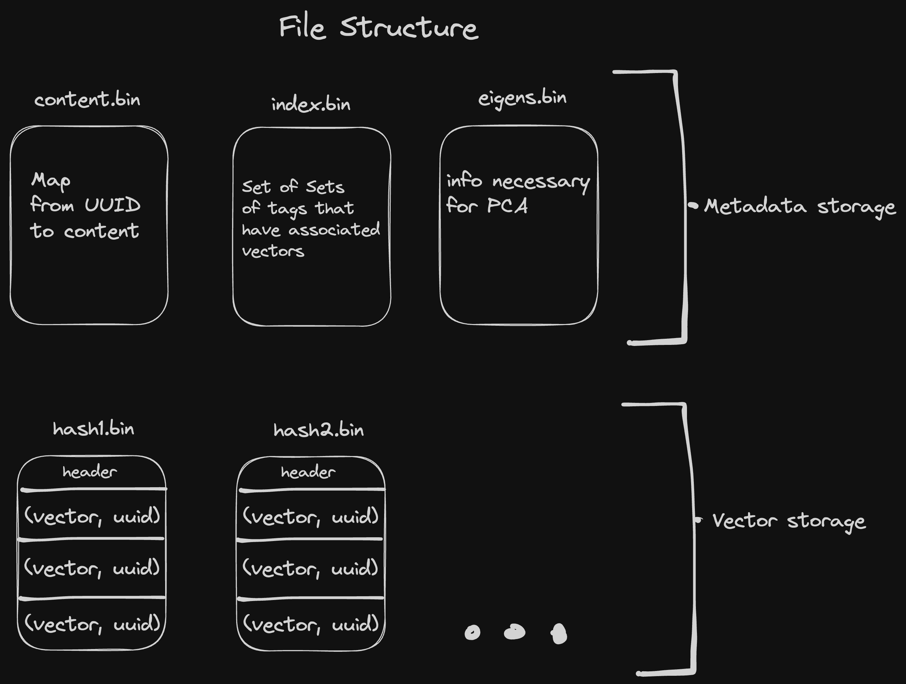

## Victor

Web-optimized vector database (written in Rust).

## Features

1. Rust API (using native filesystem, or a transient in-memory filesystem)
2. Web API (Using the [Private Origin File System](https://web.dev/origin-private-file-system/))
3. Very efficient vector storage format
   1. For a vector with 1536 dimensions, our representation consumes 1.5 KB, while naively encoding with JSON would consume 20.6 KB.
4. PCA for vector compression when storage space is low

## Installation

`npm install victor-db`

## Example

```ts
import { Db } from "victor";

const db = await Db.new();

const content = "My content!";
const tags = ["these", "are", "tags"];
const embedding = new Float64Array(/* your embedding here */);

// write to victor
await db.insert(content, embedding, tags);

// read from victor
const result = await db.search(embedding, ["tags"]);
assert(result == content);

// clear database
await db.clear();
```

See `www/` for a more complete example, including fetching embeddings from OpenAI.

## Hacking

1. Victor is written in Rust, and compiled to wasm with wasm-pack.

   **Install wasm** pack with `cargo install wasm-pack` or `npm i -g wasm-pack`
   (https://rustwasm.github.io/wasm-pack/installer/)

2. **Build Victor** with `wasm-pack build`

3. **Set up the example project**, which is in `www/`.

   If you use nvm, you can just run `cd www/ && nvm use`

   Then, `npm i`.

4. From `www/`, start the example project with `npm run start`.

## Architecture

Relevant code at `src/packed_vector.rs`.


---



## Us

[Sam Hall](https://twitter.com/Shmall27)

[Andre Popovitch](https://twitter.com/ChadNauseam)
